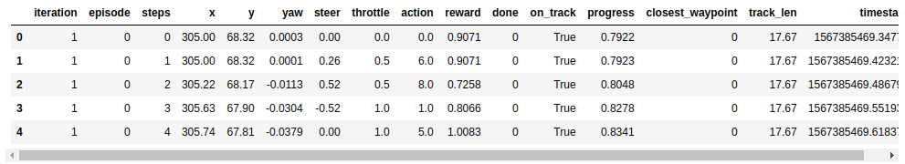

# Nanodegree Engenheiro de Machine Learning
## Projeto final
Cristian Carlos dos Santos 
22 de setembro de 2019

## I. Definição
_(aprox. 1-2 páginas)_

### Visão geral do projeto
Nesta seção, procure fornecer uma visão de alto nível do projeto em linguagem simples. Questões para se perguntar ao escrever esta seção:
- _Foi fornecido um resumo do projeto final, bem como o domínio do problema, a origem do projeto e o conjunto de dados ou entradas?_
- _Foram dadas informações suficientes sobre o contexto para que um leitor desinformado possa entender o domínio e a enunciação problema?_

_(aprox. 1-2 parágrafos)_

#### Resumo

O projeto tem como tema o AWS Deep Racer da Amazon. Como a própria Amazon descreve:

“AWS DeepRacer is a reinforcement learning (RL)-enabled autonomous 1/18th-scale vehicle with supporting services in the AWS Machine Learning ecosystem. It offers an interactive learning system for users of all levels to acquire and refine their skill set in machine learning in general and reinforcement learning in particular. You can use the AWS DeepRacer console to train and evaluate deep reinforcement learning models in simulation and then deploy them to an AWS DeepRacer vehicle for autonomous driving. You can also join AWS DeepRacer League to race in the online Virtual Circuit or the in-person Summit Circuit.”[1]

Esse modelo de competição e aprendizado de RL faz com que aprendamos sobre o assunto que é um campo de estudo fascinante, porém muito complexo. Recentemente a Udacity lançou o AWS DeepRacer Scholarship Challenge e como não havia selecionado a minha proposta para o trabalho final resolvi applicá-la no meu trabalho.

### Descrição do problema
Nesta seção, você irá definir o problema que você está tentando resolver de forma clara, incluindo a estratégia (resumo das tarefas) que você irá utilizar para alcançar a solução desejada. Você deverá também discutir detalhadamente qual será a solução pretendida para este problema. Questões para se perguntar ao escrever esta seção:
- _A enunciação do problema foi claramente definida? O leitor irá entender o que você está esperando resolver?_
- _Você discutiu detalhadamente como irá tentar resolver o problema?_
- _A solução antecipada está claramente definida? O leitor entenderá quais resultados você está procurando?_

O objetivo do meu projeto é desenvolver e fazer com que o carrinho chegue no final completando 100% da pista. Porém, como o custo com o AWS DeepRacer pode se tornar alto rapidamente, procurarei a melhor solução com poucos recursos. Minha meta pessoa é U$50,00.

#### Conjuntos de dados e entradas

O AWS DeepRacer treina os modelos usando o algoritmo PPO (Proximal Policy Optimization). Segundo a vídeo aula “Value Functions” (L4: Reinforcement Learning) do curso AWS DeepRacer [2], esse algoritmo é utilizado por ser eficiente, estável e fácil de usar comparado com outros algoritmos. O Algoritmo usa duas redes neurais durante o treinamento: Policy Network (Actor Network) e Value Network (Critic Network).

-   Policy Network: Decide qual ação tomar de acordo com a imagem recebida no input.
-   Value Network: Estima o resultado cumulativo que provavelmente obteremos, considerando a imagem como uma entrada.

##### Reward

A função de recompensa será o guia do nosso algoritmo. Ela que recompensará as ações positivas, ou seja que eu gostaria que o carrinho realizasse. Além disso, ela também penalizará açõs indesejadas, como sair da pista durante a corrida. Para a construção da função de recompensa temos uma entrada de uma variável chamada “params”. Essa variável é uma biblioteca no seguinte formato:

```
{
    "all_wheels_on_track": Boolean,    # flag to indicate if the vehicle is on the track
    "x": float,                        # vehicle's x-coordinate in meters
    "y": float,                        # vehicle's y-coordinate in meters
    "distance_from_center": float,     # distance in meters from the track center 
    "is_left_of_center": Boolean,      # Flag to indicate if the vehicle is on the left side to the track center or not. 
    "heading": float,                  # vehicle's yaw in degrees
    "progress": float,                 # percentage of track completed
    "steps": int,                      # number steps completed
    "speed": float,                    # vehicle's speed in meters per second (m/s)
    "steering_angle": float,          # vehicle's steering angle in degrees
    "track_width": float,              # width of the track
    "waypoints": [[float, float], … ], # list of [x,y] as milestones along the track center
    "closest_waypoints": [int, int]    # indices of the two nearest waypoints.
}

```

Mais informações sobre a função de recompensa estão disponíveis na documentação de desenvolvedores da Amazon Deep Racer [3].

##### Hyperparâmetros

Os Hiperparâmetros algorítmicos são opções disponíveis nas redes neurais citadas acima. Com eles podemos acelerar ajustes de funções e definir pontos importantes do processo de Reinforcement Learning, como fazer com que nosso algoritmo priorize ações de maior recompensa já descoberta ou explore mais ações a fim de encontrar uma ação melhor em determinado estado. No console da AWS Deep Racer temos  os seguintes parâmetros:
- Gradient descent batch size (Tamanho de lote da descida de gradiente)  
- Number of epochs (Número de epochs)  
- Learning rate (Taxa de aprendizado)  
- Entropy  
- Discount factor (Fator de desconto)  
- Loss type (Tipo de perda)  
- Number of experience episodes between each policy-updating iteration - (Número de episódios de experiência entre cada iteração de atualização de política)

É possível encontrar informações mais detalhadas sobre cada um no guia de desenvolvedores do AWS Deep Racer , na seção de ajustes de parâmetros [4].

#### Solução
Para solucionar o problema proposto utilizarei como ponto de partida os exemplos de função de recompensa e hiperparâmetros disponíveis nos exemplos da documentação da AWS Deep Racer. 
##### Reward
Para a função de recompensa utilizarei formas de maximizar ações esperadas, como manter-se na pista, ganhar velocidade e completar voltas. Para isso a ideia é usar como base da função de recompensa os parâmetros `distance_from_center` and `all_wheels_on_track`. Além disso, vou usar como multiplicador da recompensa o `progress` a fim de que a recompensa seja maior de acordo com o avanço na pista.
##### Hyperparâmetros
Para os hiperparâmetros, conforme vídeo “Intro to Tuning Hyperparameters” (L5: Tuning your model - AWS DeepRacer Course): “Figuring out what works best for your model is usually done through trial and error.”


#### Métricas
Nesta seção, você precisará definir claramente as métricas ou cálculos que você irá usar para avaliar o desempenho de um modelo ou resultado no seu projeto. Esses cálculos e métricas devem ser justificadas baseado nas características do problema e domínio do problema. Questões para se perguntar ao escrever esta seção:
- _As métricas que você escolheu para medir o desempenho de seus modelos foram discutidas e definidas de forma clara?_
- _Você forneceu justificativas razoáveis para as métricas escolhidas, baseando-se no problema e solução?_

Para a métrica de avaliação a ideia é usar o **percentual de conclusão da pista**, **o tempo de conclusão de volta**, as recompensas por iteração e a avaliação do algoritmo em pistas diferentes. Para facilitar essa análise utilizarei o Jupyter notebook disponibilizado no artigo “Using Jupyter Notebook for analysing DeepRacer’s logs” [5].


## II. Análise
_(aprox. 2-4 páginas)_

### Exploração dos dados
Nesta seção, é esperado que você analise os dados que você está usando para o problema. Esses dados podem ser tanto na forma de um conjunto de dados (ou conjuntos de dados), dados de entrada (ou arquivos de entrada), ou até um ambiente. O tipo de dados deve ser descrito detalhadamente e, se possível, ter estatísticas e informações básicas apresentadas (tais como discussão dos atributos de entrada ou definição de características das entradas ou do ambiente) Qualquer anormalidade ou qualidade interessante dos dados que possam precisar ser devidamente tratadas devem ser identificadas (tais como características que precisem ser transformadas ou a possibilidade de valores atípicos) Questões para se perguntar ao escrever esta seção:
- _Se exite um conjunto de dados para o problema em questão, você discutiu totalmente as características desse conjunto? Uma amostra dos dados foi oferecida ao leitor?_
- _Se existe um conjunto de dados para o problema, as estatísticas sobre eles foram calculadas e reportadas? Foram discutidos quaisquer resultados relevantes desses cálculos?_
- _Se **não** existe um conjunto de dados para o problema, foi realizada uma discussão sobre o espaço de entrada ou os dados de entrada do problema?_
- _Existem anormalidades ou características acerca do espaço de entrada ou conjunto de dados que necessitem ser direcionados? (variáveis categóricas, valores faltando, valores atípicos, etc.)_

A partir do treino e da avaliação realizada no console do AWS Deep Racer, são gerados arquivos de logs do treinamento e da avaliação. Utilizando o modelo de análise disponível no AWS Deepracer Workshop Lab Github [6] é possível realizar o download desses logs e iniciar a avaliação, atraveś do arquivo `log-analysis/DeepRacer Log Analysis.ipynb`. Além dos logs de treinamento/avaliação é gerado um modelo referente as redes neurais que fazem parte do algoritmo já explicado acima. No console AWS é possível realizar o download deste modelo para que o mesmo também seja avaliado no Jupyter Notebook já mencionado acima.

Meu objetivo inicial foi encontrar, com a função de recompensa baseada nos padrões básicos dos exemplos da documentação e hyperparâmetros padrões, o menor tempo necessário de treinamento para que o carrinho completasse uma volta. O mínimo de tempo que encontrei foi 1H. Segue a função de recompensa usada e os hyper parâmetros:

**Função de recompensa:**

    def reward_function(params):
	    # Read input parameters
	    track_width = params['track_width']
	    distance_from_center = params['distance_from_center']
	    all_wheels_on_track = params['all_wheels_on_track']
	    steering = abs(params['steering_angle']) # Only need the absolute steering angle
	    progress = params['progress']
	    speed = params['speed']
	    SPEED_THRESHOLD = 1.0
	    SPEED_THRESHOLD_3 = 3.0
	    # Steering penality threshold, change the number based on your action space setting
	    ABS_STEERING_THRESHOLD = 20

	    # Calculate 3 markers that are at varying distances away from the center line
	    marker_1 = 0.1 * track_width
	    marker_2 = 0.25 * track_width
	    marker_3 = 0.5 * track_width

	    # Give higher reward if the car is closer to center line and vice versa
	    if distance_from_center <= marker_1:
	        reward = 1.0
	    elif distance_from_center <= marker_2:
	        reward = 0.5
	    elif distance_from_center <= marker_3:
	        reward = 0.1
	    else:
	        reward = 1e-3  # likely crashed/ close to off track

	    if not all_wheels_on_track:
	        # Penalize if the car goes off track
	        reward = 1e-3
	    elif speed < SPEED_THRESHOLD:
	        # Penalize if the car goes too slow
	        reward = reward - 0.1
	    else:
	        # High reward if the car stays on track and goes fast
	        reward = reward * speed

	    if steering > ABS_STEERING_THRESHOLD:
	        # Penalize reward if the agent is steering too much
	        reward *= 0.8

	    reward = reward + (reward * (progress / 100))

	    return float(reward)

Essa função de recompensa é busca manter o carrinho na pista, sem grandes zigue-zague e adicionando um multiplicador pela velocidade.

**Hyperparâmetros:**

| Hyperparâmetro              |      Value    |
|-----------------------------|:-------------:|
| Gradient descent batch size | 64            |
|Entropy|0.01|
|Discount factor | 0.999 |
|Loss type|Huber|
|Learning rate|0.0003|
|N. of experience episodes between each policy-updating iteration|20|
|Number of epochs|10|

Os hyperparâmetros serão mantidos estes inicialmente.

##### Estrutura de logs
Ao utilizar o notebook `DeepRacer Log Analysis.ipynb` temos recursos de download os logs direto da AWS, desde que o AWS Client seja configurado. Os arquivos necessário para executar os notebooks avaliados neste relatório estarão todos disponíveis na pasta
Os logs de treinamento após serem carregados para um DataFrame são exibidos conforme o exemplo abaixo:

A partir dessa estrutura básica é possível realizar

### Visualização exploratória
Nesta seção, você precisará fornecer alguma forma de visualização que sintetize ou evidencie uma característica ou atributo relevante sobre os dados. A visualização deve sustentar adequadamente os dados utilizados. Discuta por que essa visualização foi escolhida e por que é relevante. Questões para se perguntar ao escrever esta seção:
- _Você visualizou uma característica ou um atributo relevante acerca do conjunto de dados ou dados de entrada?_
- _A visualização foi completamente analisada e discutida?_
- _Se um gráfico foi fornecido, os eixos, títulos e dados foram claramente definidos?_

### Algoritmos e técnicas
Nesta seção, você deverá discutir os algoritmos e técnicas que você pretende utilizar para solucionar o problema. Você deverá justificar o uso de cada algoritmo ou técnica baseado nas características do problema e domínio do problema. Questões para se perguntar ao escrever esta seção:
- _Os algoritmos que serão utilizados, incluindo quaisquer variáveis/parâmetros padrão do projeto, foram claramente definidos?_
- _As técnicas a serem usadas foram adequadamente discutidas e justificadas?_
- _Ficou claro como os dados de entrada ou conjuntos de dados serão controlados pelos algoritmos e técnicas escolhidas?_

### Benchmark
Nesta  seção, você deverá definir claramente um resultado de referência (benchmark) ou limiar para comparar entre desempenhos obtidos pela sua solução. O raciocínio por trás da referência (no caso onde não é estabelecido um resultado) deve ser discutido. Questões para se perguntar ao escrever esta seção:
- _Algum resultado ou valor que funcione como referência para a medida de desempenho foi fornecido?_
- _Ficou claro como esse resultado ou valor foi obtido (seja por dados ou por hipóteses)?_


## III. Metodologia
_(aprox. 3-5 páginas)_

### Pré-processamento de dados
Nesta seção, você deve documentar claramente todos os passos de pré-processamento que você pretende fazer, caso algum seja necessário. A partir da seção anterior, quaisquer anormalidades ou características que você identificou no conjunto de dados deverão ser adequadamente direcionadas e tratadas aqui. Questões para se perguntar ao escrever esta seção:
- _Se os algoritmos escolhidos requerem passos de pré-processamento, como seleção ou transformações de atributos, tais passos foram adequadamente documentados?_
- _Baseado na seção de **Exploração de dados**, se existiram anormalidade ou características que precisem ser tratadas, elas foram adequadamente corrigidas?_
- _Se não é necessário um pré-processamento, foi bem definido o porquê?_

### Implementação
Nesta seção, o processo de escolha de quais métricas, algoritmos e técnicas deveriam ser implementados para os dados apresentados deve estar claramente documentado. Deve estar bastante claro como a implementação foi feita, e uma discussão deve ser elaborada a respeito de quaisquer complicações ocorridas durante o processo.  Questões para se perguntar ao escrever esta seção:
- _Ficou claro como os algoritmos e técnicas foram implementados com os conjuntos de dados e os dados de entrada apresentados?_
- _Houve complicações com as métricas ou técnicas originais que acabaram exigindo mudanças antes de chegar à solução?_
- _Houve qualquer parte do processo de codificação (escrita de funções complicadas, por exemplo) que deveriam ser documentadas?_

### Refinamento
Nesta seção, você deverá discutir o processo de aperfeiçoamento dos algoritmos e técnicas usados em sua implementação. Por exemplo, ajuste de parâmetros para que certos modelos obtenham melhores soluções está dentro da categoria de refinamento. Suas soluções inicial e final devem ser registradas, bem como quaisquer outros resultados intermediários significativos, conforme o necessário. Questões para se perguntar ao escrever esta seção:
- _Uma solução inicial foi encontrada e claramente reportada?_
- _O processo de melhoria foi documentado de foma clara, bem como as técnicas utilizadas?_
- _As soluções intermediárias e finais foram reportadas claramente, conforme o processo foi sendo melhorado?_


## IV. Resultados
_(aprox. 2-3 páginas)_

### Modelo de avaliação e validação
Nesta seção, o modelo final e quaisquer qualidades que o sustentem devem ser avaliadas em detalhe. Deve ficar claro como o modelo final foi obtido e por que tal modelo foi escolhido. Além disso, algum tipo de análise deve ser realizada para validar a robustez do modelo e sua solução, como, por exemplo, manipular os dados de entrada ou o ambiente para ver como a solução do modelo é afetada (técnica chamada de análise sensitiva). Questões para se perguntar ao escrever esta seção:
- _O modelo final é razoável e alinhado com as expectativas de solução? Os parâmetros finais do modelo são apropriados?_
- _O modelo final foi testado com várias entradas para avaliar se o modelo generaliza bem com dados não vistos?_
-_O modelo é robusto o suficiente para o problema? Pequenas perturbações (mudanças) nos dados de treinamento ou no espaço de entrada afetam os resultados de forma considerável?_
- _Os resultados obtidos do modelo são confiáveis?_

### Justificativa
Nesta seção, a solução final do seu modelo e os resultados dela obtidos devem ser comparados aos valores de referência (benchmark) que você estabeleceu anteriormente no projeto, usando algum tipo de análise estatística. Você deverá também justificar se esses resultados e a solução são significativas o suficiente para ter resolvido o problema apresentado no projeto. Questões para se perguntar ao escrever esta seção:
- _Os resultados finais encontrados são mais fortes do que a referência reportada anteriormente?_
- _Você analisou e discutiu totalmente a solução final?_
- _A solução final é significativa o suficiente para ter resolvido o problema?_


## V. Conclusão
_(aprox. 1-2 páginas)_

### Foma livre de visualização
Nesta seção, você deverá fornecer alguma forma de visualização que enfatize uma qualidade importante do projeto. A visualização é de forma livre, mas deve sustentar de forma razoável um resultado ou característica relevante sobre o problema que você quer discutir. Questões para se perguntar ao escrever esta seção:
- _Você visualizou uma qualidade importante ou relevante acerca do problema, conjunto de dados, dados de entrada, ou resultados?_
- _A visualização foi completamente analisada e discutida?_
- _Se um gráfico foi fornecido, os eixos, títulos e dados foram claramente definidos?_

### Reflexão
Nesta seção, você deverá resumir os procedimentos desde o problema até a solução e discutir um ou dois aspectos  do projeto que você achou particularmente interessante ou difícil. É esperado que você reflita sobre o projeto como um todo de forma a mostrar que você possui um entendimento sólido de todo o processo empregado em seu trabalho. Questões para se perguntar ao escrever esta seção:
- _Você resumiu inteiramente o processo que você utilizou neste projeto?_
- _Houve algum aspecto interessante do projeto?_
- _Houve algum aspecto difícil do projeto?_
- _O modelo e solução final alinham-se com suas expectativas para o problema, e devem ser usadas de forma geral para resolver esses tipos de problemas?_

### Melhorias
Nesta seção, você deverá discutir como um aspecto da sua implementação poderia ser melhorado. Por exemplo, considere maneiras de tornar a sua implementação mais geral e o que precisaria ser modificado. Você não precisa fazer a melhoria, mas as possíveis soluções que resultariam de tais mudanças devem ser consideradas e comparadas/contrastadas com a sua solução atual. Questões para se perguntar ao escrever esta seção:
- _Existem melhorias futuras que podem ser feitas nos algoritmos ou técnicas que você usou neste projeto?_
- _Existem algoritmos ou técnicas que você pesquisou, porém não soube como implementá-las, mas consideraria usar se você soubesse como?_
- _Se você usou sua solução final como nova referência, você acredita existir uma solução ainda melhor?_

-----------

**Antes de enviar, pergunte-se. . .**

- _O relatório de projeto que você escreveu segue uma estrutura bem organizada, similar ao modelo do projeto?_
- Cada seção (particularmente **Análise** e **Metodologia**) foi escrita de maneira clara, concisa e específica? Existe algum termo ou frase ambígua que precise de esclarecimento?
- O público-alvo do seu projeto será capaz de entender suas análises, métodos e resultados?
- Você revisou seu relatório de projeto adequadamente, de forma a minimizar a quantidade de erros gramaticais e ortográficos?
- Todos os recursos usados neste projeto foram corretamente citados e referenciados?
- O código que implementa sua solução está legível e comentado adequadamente?
- O código é executado sem erros e produz resultados similares àqueles reportados?


### Referências:
[1] [https://aws.amazon.com/deepracer/?nc1=h_ls](https://aws.amazon.com/deepracer/?nc1=h_ls)
[2] [https://www.udacity.com/aws-deepracer-scholarship](https://www.udacity.com/aws-deepracer-scholarship)
[3 [https://docs.aws.amazon.com/pt_br/deepracer/latest/developerguide/deepracer-reward-function-input.html](https://docs.aws.amazon.com/pt_br/deepracer/latest/developerguide/deepracer-reward-function-input.html)
[4] [https://docs.aws.amazon.com/pt_br/deepracer/latest/developerguide/deepracer-console-train-evaluate-models.html#deepracer-iteratively-adjust-hyperparameters](https://docs.aws.amazon.com/pt_br/deepracer/latest/developerguide/deepracer-console-train-evaluate-models.html#deepracer-iteratively-adjust-hyperparameters)
[5][https://codelikeamother.uk/using-jupyter-notebook-for-analysing-deepracer-s-logs](https://codelikeamother.uk/using-jupyter-notebook-for-analysing-deepracer-s-logs)
[6][https://github.com/aws-samples/aws-deepracer-workshops](https://github.com/aws-samples/aws-deepracer-workshops)
<!--stackedit_data:
eyJoaXN0b3J5IjpbNzYwOTc2MDk0LDgxMTIzODMyOSwtOTYxMD
c4NzE5LDE2NzM0MDEwMjMsMTYzMjQ2NjYyMywxNTI5NTc5NDks
LTgwMDE5MTc1OSwxNDk1NTA0MDcxLDU1NjQ3MDUxOCwzNTM3MT
k0MjMsLTg1MDkzMDM0XX0=
-->