# Nanodegree Engenheiro de Machine Learning
## Capstone Project
Cristian Carlos dos Santos 
22 de setembro de 2019

## I. Definition

### Project Overview

#### Summary

The project is themed on AWS Deep Racer from Amazon. As Amazon itself describes:

“AWS DeepRacer is a reinforcement learning (RL) -enabled autonomous 1 / 18th-scale vehicle with supporting services in the AWS Machine Learning ecosystem. It offers an interactive learning system for users of all levels to acquire and refine their skill set in machine learning in general and reinforcement learning in particular. You can use the AWS DeepRacer console to train and evaluate deep reinforcement learning models in simulation and then deploy them to an AWS DeepRacer vehicle for autonomous driving. You can also join AWS DeepRacer League to race in the online Virtual Circuit or the in-person Summit Circuit. ” [\[1\]](https://aws.amazon.com/deepracer/?nc1=h_ls)

This model of competition and RL learning makes us learn about the subject which is a fascinating but very complex field of study. Recently Udacity launched the AWS DeepRacer Scholarship Challenge and as I had not selected my proposal for the final work I decided to accept this challenge.

### Problem Statement

The goal of my project is to develop and make the cart reach the end by completing 100% of the track. However, as the cost with AWS DeepRacer can quickly become high, I will look for the best solution with few features. My personal goal is $ 50.

#### Datasets and Entries

AWS DeepRacer trains models using the Proximal Policy Optimization (PPO) algorithm. According to AWS DeepRacer course “Value Functions” (L4: Reinforcement Learning) video [\[2\]](https://www.udacity.com/aws-deepracer-scholarship), this algorithm is used because it is efficient, stable and easy to use compared to other algorithms. The Algorithm uses two neural networks during training: Policy Network (Actor-Network) and Value Network (Critic Network).
- Policy Network: Decides what action to take according to the image received in the input.
- Value Network: Estimates the cumulative result we are likely to get, considering the image as an input.

##### Reward

A função de recompensa será o guia do algoritmo. Ela que recompensará as ações positivas, ou seja, o que eu gostaria que o carrinho realizasse. Além disso, ela também penalizará açõs indesejadas, como sair da pista durante a corrida. Para a construção da função de recompensa temos uma entrada de uma variável chamada `params`. Essa variável é uma biblioteca no seguinte formato:

```
{
    "all_wheels_on_track": Boolean,    # flag to indicate if the vehicle is on the track
    "x": float,                        # vehicle's x-coordinate in meters
    "y": float,                        # vehicle's y-coordinate in meters
    "distance_from_center": float,     # distance in meters from the track center 
    "is_left_of_center": Boolean,      # Flag to indicate if the vehicle is on the left side to the track center or not. 
    "heading": float,                  # vehicle's yaw in degrees
    "progress": float,                 # percentage of track completed
    "steps": int,                      # number steps completed
    "speed": float,                    # vehicle's speed in meters per second (m/s)
    "steering_angle": float,          # vehicle's steering angle in degrees
    "track_width": float,              # width of the track
    "waypoints": [[float, float], … ], # list of [x,y] as milestones along the track center
    "closest_waypoints": [int, int]    # indices of the two nearest waypoints.
}

```

Mais informações sobre a função de recompensa estão disponíveis na documentação de desenvolvedores da Amazon Deep Racer [\[3\]](https://docs.aws.amazon.com/pt_br/deepracer/latest/developerguide/deepracer-reward-function-input.html).

##### Hyperparâmetros

Os Hiperparâmetros algorítmicos são opções disponíveis nas redes neurais citadas acima. Com eles podemos acelerar ajustes de funções e definir pontos importantes do processo de Reinforcement Learning, como fazer com que nosso algoritmo priorize ações de maior recompensa já descoberta ou explore mais ações a fim de encontrar uma ação melhor em determinado estado. No console da AWS Deep Racer temos  os seguintes parâmetros:
- Gradient descent batch size (Tamanho de lote da descida de gradiente)  
- Number of epochs (Número de epochs)  
- Learning rate (Taxa de aprendizado)  
- Entropy  
- Discount factor (Fator de desconto)  
- Loss type (Tipo de perda)  
- Number of experience episodes between each policy-updating iteration - (Número de episódios de experiência entre cada iteração de atualização de política)

É possível encontrar informações mais detalhadas sobre cada um no guia de desenvolvedores do AWS Deep Racer , na seção de ajustes de parâmetros [\[4\]](https://docs.aws.amazon.com/pt_br/deepracer/latest/developerguide/deepracer-console-train-evaluate-models.html#deepracer-iteratively-adjust-hyperparameters).

#### Solução
Para solucionar o problema proposto utilizarei como ponto de partida os exemplos de função de recompensa e hiperparâmetros disponíveis nos exemplos da documentação da AWS Deep Racer. 
##### Reward
Para a função de recompensa utilizarei formas de maximizar ações esperadas, como manter-se na pista, ganhar velocidade e completar voltas. Para isso a ideia é usar como base da função de recompensa os parâmetros `distance_from_center` and `all_wheels_on_track`. Além disso, vou usar como multiplicador da recompensa o `progress` a fim de que a recompensa seja maior de acordo com o avanço na pista.
##### Hyperparâmetros
Para os hiperparâmetros, conforme vídeo “Intro to Tuning Hyperparameters” (L5: Tuning your model - AWS DeepRacer Course): “Figuring out what works best for your model is usually done through trial and error.”


#### Métricas
Nesta seção, você precisará definir claramente as métricas ou cálculos que você irá usar para avaliar o desempenho de um modelo ou resultado no seu projeto. Esses cálculos e métricas devem ser justificadas baseado nas características do problema e domínio do problema. Questões para se perguntar ao escrever esta seção:
- _As métricas que você escolheu para medir o desempenho de seus modelos foram discutidas e definidas de forma clara?_
- _Você forneceu justificativas razoáveis para as métricas escolhidas, baseando-se no problema e solução?_

Para a métrica de avaliação a ideia é usar o **percentual de conclusão da pista**, **o tempo de conclusão de volta** e a visualização das recompensas por iteração. Para facilitar essa análise utilizarei o Jupyter notebook disponibilizado no artigo “Using Jupyter Notebook for analysing DeepRacer’s logs” [\[5\]](https://codelikeamother.uk/using-jupyter-notebook-for-analysing-deepracer-s-logs).


## II. Análise

### Exploração dos dados - Treinamento

A partir do treino e da avaliação realizada no console do AWS Deep Racer, são gerados arquivos de logs do treinamento e da avaliação. Utilizando o modelo de análise disponível no AWS Deepracer Workshop Lab Github [\[6\]](https://github.com/aws-samples/aws-deepracer-workshops) é possível realizar o download desses logs e iniciar a avaliação, atraveś do arquivo `log-analysis/DeepRacer Log Analysis.ipynb`. Além dos logs de treinamento/avaliação é gerado um modelo referente as redes neurais que fazem parte do algoritmo já explicado acima. No console AWS é possível realizar o download deste modelo para que o mesmo também seja avaliado no Jupyter Notebook já mencionado acima.

Meu objetivo inicial foi encontrar, com a função de recompensa baseada nos padrões básicos dos exemplos da documentação e hyperparâmetros padrões, o menor tempo necessário de treinamento para que o carrinho completasse uma volta. O mínimo de tempo que encontrei na pista **re:Invent 2018** foi 1H. Segue a função de recompensa usada e os hyper parâmetros:

**Função de recompensa:**

    def reward_function(params):
	    # Read input parameters
	    track_width = params['track_width']
	    distance_from_center = params['distance_from_center']
	    all_wheels_on_track = params['all_wheels_on_track']
	    steering = abs(params['steering_angle']) # Only need the absolute steering angle
	    progress = params['progress']
	    speed = params['speed']
	    SPEED_THRESHOLD = 1.0
	    SPEED_THRESHOLD_3 = 3.0
	    # Steering penality threshold, change the number based on your action space setting
	    ABS_STEERING_THRESHOLD = 20

	    # Calculate 3 markers that are at varying distances away from the center line
	    marker_1 = 0.1 * track_width
	    marker_2 = 0.25 * track_width
	    marker_3 = 0.5 * track_width

	    # Give higher reward if the car is closer to center line and vice versa
	    if distance_from_center <= marker_1:
	        reward = 1.0
	    elif distance_from_center <= marker_2:
	        reward = 0.5
	    elif distance_from_center <= marker_3:
	        reward = 0.1
	    else:
	        reward = 1e-3  # likely crashed/ close to off track

	    if not all_wheels_on_track:
	        # Penalize if the car goes off track
	        reward = 1e-3
	    elif speed < SPEED_THRESHOLD:
	        # Penalize if the car goes too slow
	        reward = reward - 0.1
	    else:
	        # High reward if the car stays on track and goes fast
	        reward = reward * speed

	    if steering > ABS_STEERING_THRESHOLD:
	        # Penalize reward if the agent is steering too much
	        reward *= 0.8

	    reward = reward + (reward * (progress / 100))

	    return float(reward)

Essa função de recompensa é busca manter o carrinho na pista, sem grandes zigue-zague e adicionando um multiplicador pela velocidade.

**Hyperparâmetros:**

| Hyperparâmetro              |      Value    |
|-----------------------------|:-------------:|
| Gradient descent batch size | 64            |
|Entropy|0.01|
|Discount factor | 0.999 |
|Loss type|Huber|
|Learning rate|0.0003|
|N. of experience episodes between each policy-updating iteration|20|
|Number of epochs|10|

Os hyperparâmetros serão mantidos estes inicialmente.

##### Estrutura de logs
Ao utilizar o notebook `DeepRacer Log Analysis.ipynb` temos recursos de download os logs direto da AWS, desde que o AWS Client seja configurado. Os arquivos necessário para executar os notebooks avaliados neste relatório estarão todos disponíveis na pasta **log-analysis/** (logs) e **log-analysis/intermediate_checkpoint** (modelos).

##### Notebook de Análise
Inicialmente vamos avaliar o notebook resultante de 1 hora de treinamento com as funções definidas acima. O mesmo encontra-se na pasta `log-analysis/` com nome `06 - DeepRacer Log Analysis - MyTrain 60 min speed.ipynb`.

Os logs de treinamento após serem carregados para um DataFrame são exibidos conforme o exemplo abaixo:


Para avaliar as estatísticas selecionei as colunas que achei mais importantes para a avaliação:


Na imagem é possível avaliar os seguinte pontos:

- **Iteration (2) and episode (39)**: Temos um número baixo de iterações e episódios devido ao baixo tempo de treinamento.
- **Throttle:** Com uma média de 0.7765 é possível avaliar que o carrinho esteve acelerando boa parte do tempo de treinamento.
- **Reward:** Temos uma média de recompensa de 1.05. Se formos avaliar a função de recompensa atual, podemos verificar que essa recompensa é atribuída quando o carrinhos está muito próximo ao centro da pista. Como o foco da corrida é tempo de volta, possivelmente a base da recompensa não poderá ser a distância do centro da pista.
- **Progress:** Bom, chegamos no 100%.

### Visualização exploratória - Treinamento

#### Avaliação de recompensa por ações

Para avaliação dos gráficos a seguir é necessário tomar como base que o eixo X e o eixo Y são, respectivamente, colunas X e Y do Dataframe avaliado na seção "notebooks de análise".

##### Avaliação geral

Na imagem abaixo é possível verificar as recompensas retornadas no processo de treinamento.


##### Avaliação iteração 2

Na imagem abaixo é possível verificar as recompensas de uma iteração específica do treinamento.


##### Path taken for top reward iterations


Nas imagens acima é possível confirmar o que foi levantado na seção "Notebook de Análise" quanto a questão da recompensa ter uma média próxima a 1 devido a base da composição da recompensa ser a distância do centro da pista. Tanto na imagem de avaliação geral quanto a imagem de avaliação de uma iteração específica, no caso a iteração 2, é visto que a distribuição das recompensas estão muito próximas do centro da pista.

Além disso, o caminho percorrido para as iterações de maior recompensa estão extremamente alinhadas com o centro da pista. 

### Visualização exploratória - Treinamento v1

**Resultado da avaliação pela AWS:**

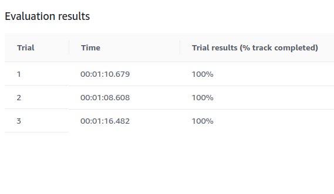

Na etapa de avaliação temos que entender como o carrinho se portou na pista durante as três tentativas de completar a corrida.

**Tentativa 1:**


**Tentativa 2:**

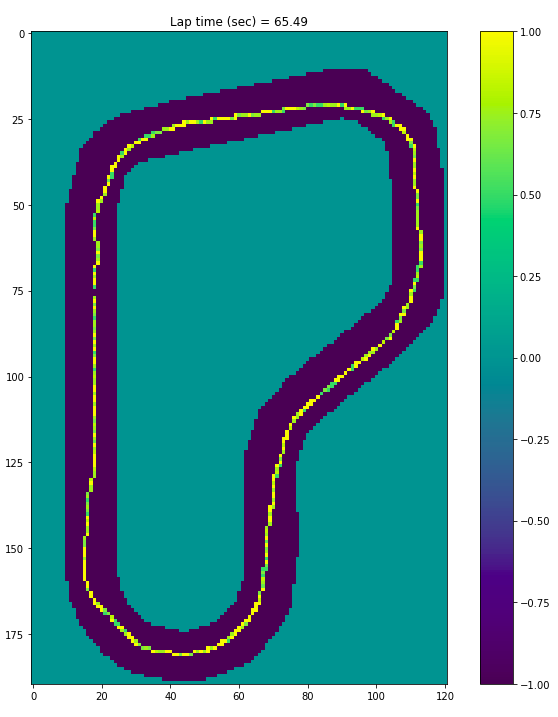


**Tentativa 3:**


É possível visualizar que o mesmo padrão do treinamento é repetido durante a fase de avaliação. O Carrinho tentou manter-se no centro da pista, por vezes sacrificando a velocidade para que isso acontecesse.

### Algoritmos e técnicas

Conforme descrito na etapa de **I.Definição** o AWS DeepRacer treina os modelos usando o algoritmo PPO (Proximal Policy Optimization). Esse projeto trata-se de um projeto de otimização do algoritmo já definido e usado pela AWS Deep Racer. Nas etapa de **Conjuntos de dados e entradas** e **Exploração dos Dados** já foram descritos a função de recompensa padrão inicial e os hyperparâmetros usados como ponto de partida para análise.

### Benchmark

Como referência, me baseio no ganhador do “re:Invent 2018" que completou a volta em 12.68 secs [\[7\]](https://medium.com/vaibhav-malpanis-blog/how-to-win-at-deepracer-league-code-and-model-included-27742b868794). Para este modelo foi usada a seguinte função de recompensa:

```
def reward_function(params):
    track_width = params['track_width']
    distance_from_center = params['distance_from_center']
    all_wheels_on_track = params['all_wheels_on_track']
    speed = params['speed']
    SPEED_THRESHOLD = 1.0 

    
    # Calculate 3 markers that are at varying distances away from the center line
    marker_1 = 0.1 * track_width
    marker_2 = 0.25 * track_width
    marker_3 = 0.5 * track_width
    
    # Give higher reward if the car is closer to center line and vice versa
    if distance_from_center <= marker_1:
        reward = 1.0
    elif distance_from_center <= marker_2:
        reward = 0.5
    elif distance_from_center <= marker_3:
        reward = 0.1
    else:
        reward = 1e-3  # likely crashed/ close to off track

    if not all_wheels_on_track:
		# Penalize if the car goes off track
        reward = 1e-3
    elif speed < SPEED_THRESHOLD:
		# Penalize if the car goes too slow
        reward = reward + 0.5
    else:
		# High reward if the car stays on track and goes fast
        reward = reward + 1.0

    return float(reward)

```

Já em hyperparâmetros foram utilizados os seguinte:

| Hyperparâmetro              |      Value    |
|-----------------------------|:-------------:|
| Gradient descent batch size | 64            |
|Entropy|0.01|
|Discount factor | 0.666 |
|Loss type|Huber|
|Learning rate|0.0003|
|N. of experience episodes between each policy-updating iteration|20|
|Number of epochs|10|

A partir desses parâmetros como referência desejo trilhar o caminho entre essa ótima referência e os parâmetros padrões. Se possível, aprimorar ainda mais o modelo e testar os resultados. **Porém, é importante salientar que o tempo de treinamento usado pelo competidor não foi informado**.


## III. Metodologia

### Pré-processamento de dados

Conforme avaliado na seção de **Exploração de dados - Treinamento** a função de recompensa padrão utilizada apresentou uma forte tendência de manter o carrinho no centro da pista. Isso não é de todo mal, porém tratando-se de uma corrida, a ideia é que o tempo de volta seja melhor.

Diante disso, alterei a função de recompensa para ter como base a velocidade do carrinho. Outra grande mudança é que a distância do centro da pista terá uma flexibilidade maior, apresentando descontos, mesmo que poucos, nas extremidades da pista. Mantive o bônus de recompensa conforme o progresso na pista e a penalização para evitar o zigue-zague.

Assim, a função atual de recompensa ficou a seguinte:

    def reward_function(params):
	    # Read input parameters
	    track_width = params['track_width']
	    distance_from_center = params['distance_from_center']
	    all_wheels_on_track = params['all_wheels_on_track']
	    steering = abs(params['steering_angle'])  # Only need the absolute steering angle
	    progress = params['progress']
	    speed = params['speed']
	    # Steering penality threshold, change the number based on your action space setting
	    ABS_STEERING_THRESHOLD = 20

	    if not all_wheels_on_track:
	        # Penalize if the car goes off track
	        reward = 1e-3
	    else:
	        reward = speed

	    # Calculate 3 markers that are at varying distances away from the center line
	    marker_1 = 0.4 * track_width
	    marker_2 = 0.45 * track_width
	    marker_3 = 0.5 * track_width

	    # Give higher reward if the car is closer to center line and vice versa
	    if distance_from_center <= marker_1:
	        reward *= 1
	    elif distance_from_center <= marker_2:
	        reward *= 0.9
	    elif distance_from_center <= marker_3:
	        reward *= 0.85
	    else:
	        reward = 1e-3  # likely crashed/ close to off track

	    if steering > ABS_STEERING_THRESHOLD:
	        # Penalize reward if the agent is steering too much
	        reward *= 0.8

	    reward = reward + (reward * (progress / 100))


	    return float(reward)


### Implementação

Após adequar a função de recompensa conforme especificado na seção **Pré-processamento de dados**, foi realizado um treinamento de 1 hora para avaliar a efetividade desta função de recompensa durante o mesmo tempo de treinamento. Uma observação importante é que não foi realizada nenhuma alteração nos hyperparâmetros, inicialmente. O notebook de análise encontra-se na pasta `log-analysis/` com nome `09 - DeepRacer Log Analysis - Final 60 min.ipynb`.

#### Visualização exploratória - Treinamento v2

Com esse treinamento foram obtidos os seguintes resultados:

##### Avaliação geral de recompensa por ações

Na imagem abaixo é possível verificar as recompensas retornadas no processo de treinamento.

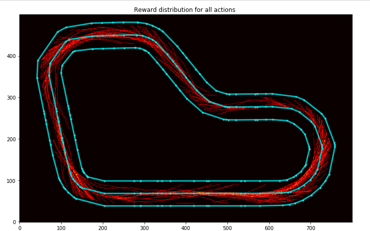

Diferente da primeira função de recompensa, é possível ver que o carrinho está explorando mais a pista. Com isso, é possível verificar mais "erros de percurso" do que na primeira versão.

##### Path taken for top reward iterations

Nessa primeira imagem é possível ver que o carrinho manteve uma certa proximidade com o centro da pista, mas não foi tão rigorosa como a do primeiro modelo.

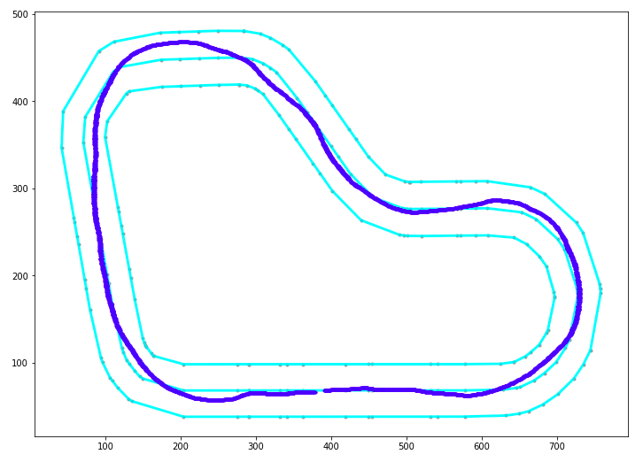

Gostaria de demonstrar que a segunda iteração mais pontuada teve menos rigor ainda que a primeira em manter o carrinho no centro da pista.

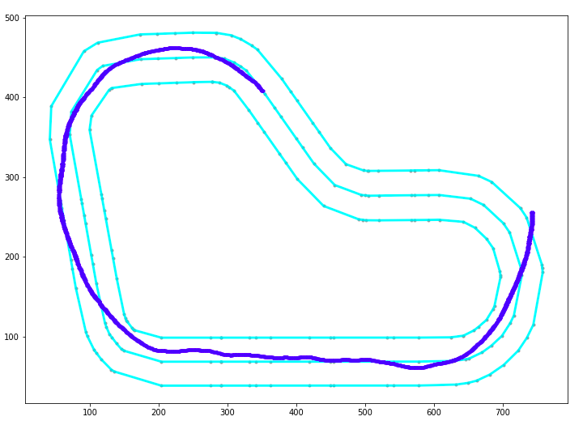


**Resultado da avaliação pela AWS:**

Na avaliação do modelo que tem a base em velocidade, 1 hora de treinamento não é o suficiente para que o mesmo complete 100% da pista.
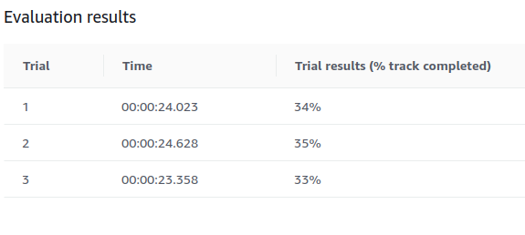

É possível ver nas tentativas o uso constante da aceleração, ocasionando a saída da pista.

**Tentativa 1:**


**Tentativa 2:**


**Tentativa 3:**


### Refinamento

Como no primeiro modelo (padrão v1) já atingi a meta de concluir 100% da pista, buscarei otimizar o tempo de conclusão de volta. Para isso farei alguns ajustes de hiperparâmetros buscando acelerar o treinamento, lembrando que a meta pessoal é não ultrapassar o custo de U$ 50,00.

Para isso, clonarei a versão 1 do modelo de treinamento (que é avaliado no notebook `09 - DeepRacer Log Analysis - Final 60 min.ipynb`, que seria o modelo com função de recompensa focada em velocidade. Com isso aproveitarei o conhecimento já construído na primeira hora de treinamento e adicionarei mais 30 minutos de treinamento com os seguintes ajustes:

- **Learning rate:** 0.0009
- **Gradient descent batch size:** 32

A ideia é que com fluxos de atualizações mais frequentes e saltos maiores, os ajustes do algoritmo sejam acelerados.

Com esses ajustes consegui os seguintes resultados de avaliação na AWS:


Temos um avanço em questão de percentual de progresso da pista, mas não de tempo de volta. Vale ressaltar que 30 minutos é um tempo baixo para uma avaliação mais concreta, mas quero destacar a seguinte iteração do carrinho:


É possível ver que na curva sinalizada o mesmo não priorizou o centro da pista e sim a velocidade. É possível ver também abaixo que o mesmo, durante a avaliação saiu da pista exatamente neste ponto:


Quanto aos gráficos de recompensa por iteração, não foram observados grandes alterações devido a função de recompensa se manter a mesma.

Recapitulando, temos até agora um modelo com uma função de recompensa baseada em velocidade que **foi treinado por 1 hora e meia**. Com isso, adicionarei **mais um treinamento de 60 minutos**, mas ajustando alguns parâmetros de recompensa.

- **Learning rate:** 0.0003
- **Discount factor:** 0.888
- **Gradient descent batch size:** 64

A ideia é caminhar novamente para parâmetros mais conservadores, mas com um pequeno ajuste no fator de desconto, pois acredito que diminuindo o número de passos futuros a serem considerados para recompensa priorize ações momentâneas.

Além disso, avaliando um pouco melhor a função de recompensa, é possível que a variável progress tenha descompensado a recompensa baseada na velocidade. 

Isso pode ter ocorrido devido ao seguinte trecho de código:

`reward = reward + (reward * (progress / 100))`

Como a recompensa é baseada na velocidade/progresso podem ocorrer os seguintes casos:

Sendo a velocidade = 1 e o progresso = 25 %, a recompensa seria:
**1.25** = 1 + (1 * (25/100))
	
Sendo a velocidade = 0.8 e o progresso = 75 %, a recompensa seria:
**1.4** = 0.8 + (0.8 * (75/100))

Com isso, é possível que com o aumento do progresso, o modelo prefira diminuir a velocidade para garantir uma recompensa maior.

Para resolver essa situação, resolvi remover esse fator relacionado ao progresso. Outra alteração foi a remoção da penalização baseada na variável `steering_angle` por dois motivos:

-  Em alguns momentos o carrinho reduzia a velocidade em trechos retos da pista somente para poder alinhar-se conforme o angulo definido (imagem abaixo).
- Como o treinamento inicial do modelo já foi realizado inicialmente com esse parâmetro, os problemas iniciais de zigue-zague foram diminuídos. 

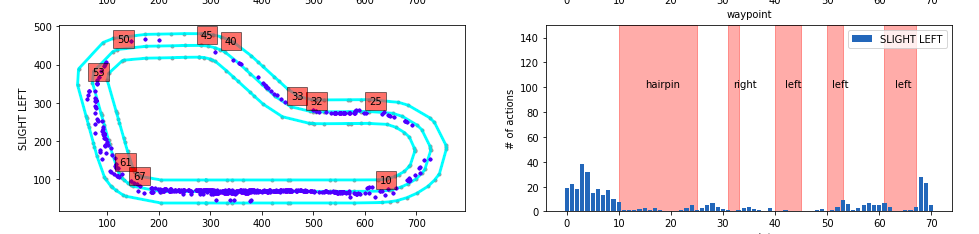

Por fim, ficam com a seguinte função de recompensa:

	def reward_function(params):
	    # Read input parameters
	    track_width = params['track_width']
	    distance_from_center = params['distance_from_center']
	    all_wheels_on_track = params['all_wheels_on_track']
	    steering = abs(params['steering_angle'])  # Only need the absolute steering angle
	    progress = params['progress']
	    speed = params['speed']
	    # Steering penality threshold, change the number based on your action space setting
	    ABS_STEERING_THRESHOLD = 20

	    if not all_wheels_on_track:
	        # Penalize if the car goes off track
	        reward = 1e-3
	    else:
	        reward = speed

	    # Calculate 3 markers that are at varying distances away from the center line
	    marker_1 = 0.4 * track_width
	    marker_2 = 0.45 * track_width
	    marker_3 = 0.5 * track_width

	    # Give higher reward if the car is closer to center line and vice versa
	    if distance_from_center <= marker_1:
	        reward *= 1
	    elif distance_from_center <= marker_2:
	        reward *= 0.9
	    elif distance_from_center <= marker_3:
	        reward *= 0.85
	    else:
	        reward = 1e-3  # likely crashed/ close to off track


	    return float(reward)

Além disso, o notebook desta análise encontra-se na pasta log-analysis/ com nome 13 - DeepRacer Log Analysis - Final 60 min - v2-v6.ipynb` .

## IV. Resultados

### Modelo de avaliação e validação

**Resultado da avaliação pela AWS:**

Antes de avaliarmos o resultado do progresso x tempo de volta, vamos somente visualizar como o treinamento distribuiu as recompensas por iterações.

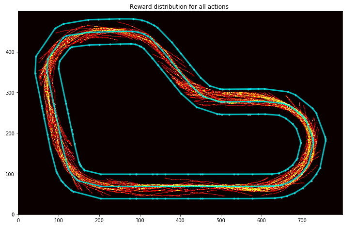

Agora vamos verificar como o modelo performou nas 3 tentativas de avaliação da AWS:

**Tentativa 1:**

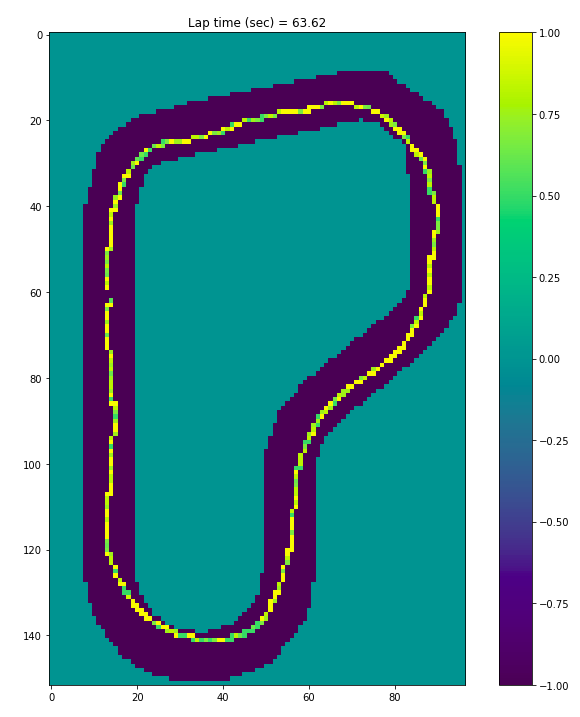


**Tentativa 2:**


**Tentativa 3:**

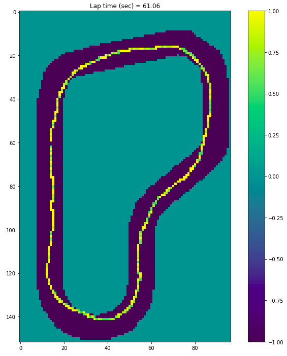


Agora vamos comprar este modelo com o modelo inicial focado na permanência no centro da pista:

**Modelo padrão (Focado na centralidade da pista):**


**Modelo atual (Focado na velocidade):**


Do modelo padrão para o modelo desenvolvido encontramos 7,071 segundos de diferença, com o total de 2,5 H de treinamento. 


### Justificativa

De certa forma os modelos desenvolvidos (Foco Centro da pista e Foco em Velocidade) apresentaram resultados melhores que o modelo de benchmark em até 3 H de treinamento.

**Modelo benchmark:**

É possível verificar na imagem abaixo que a função de recompensa e os hyperparâmetros do modelo benchmark não completaram a volta durante as três tentativas de avaliação do modelo treinado durante 3H.


Como o modelo de benchmark não deixa claro o tempo no qual foi treinado, não é possível avaliarmos o resultado de forma mais precisa.

**Modelo padrão (Focado na centralidade da pista):**


**Modelo atual (Focado na velocidade):**


Quanto a questão "*A solução final é significativa o suficiente para ter resolvido o problema?*":
Avaliando o desafio proposto, completar 100% da pista gastando menos de U$ 50,00 entendo que sim, ela é significativa o suficiente para completar o desafio dando subsídios para uma continuídade do trabalho, inclusive. 

## V. Conclusão

### Foma livre de visualização

A principal qualidade que poderia elencar no meu projeto é o conhecimento contruído sobre o funcionamento das funções de recompensas definidas e hyperparâmetros utilizados. 

As visualizações que demonstram de forma mais representativa as diferenças entre a função de recompensa inicial, focada na distância do centro da pista, e a final, focada em velocidade, são as seguintes:

**Modelo Padrão Inicial**


**Modelo Final**

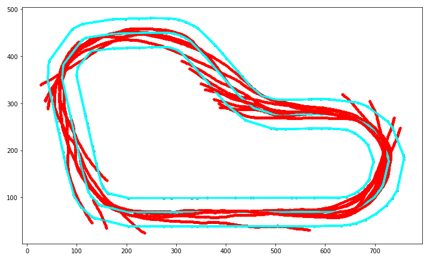

É visível a forma como o modelo padrão inicial não explorava toda extensão da pista, por vezes reduzindo a velocidade do carrinho para isso. Já na segunda imagem é possível verificar como o carrinho por vezes "espalha a curva" para compensar a velocidade. E isso tudo devido a definição base da função recompensa.

As função de recompensas utilizam um número limitado de parâmetros. Isso faz com que a possibilidade de parametrizações também sejam limitadas, porém deixa para o algoritmo de RL a maior parte do aprendizado.

O desenvolvedor da função de recompensa sempre terá que ter um equilibro entre definir uma função de recompensa extremamente complexa e uma abrangente, para que o algoritmo de RL tenha a flexibilidade de encontrar outras formas de "resolver o seu problema".


### Reflexão

Basicamente as tarefas de RL são muito exploratórios e abrangentes. Para resolver esse problema escolhido, segmentei da seguinte forma meu trabalho:
- Experimentação acerca do funcionamento da plataforma AWS Deep Racer.
- Definição dos marcos de início, como função padrão de recompensa e modelo de benchmark.
- Avaliação dos dados gerados a partir da primeira rodada de treinamento/avaliação.
- Estudo sobre impactos dos parâmetros da função de recompensa.
- Implementação da nova função de recompensa e ajuste de hyperparâmetros.
- Avaliação dos dados gerados a partir da nova rodada de treinamento/avaliação.
- Estudo sobre possiveis melhorias e pontos de impactos negativos na performance do modelo e função de recompensa.
- Nova rodada de treinamento/avaliação.
- Composição e avaliação dos resultados obtidos.

Como Reinforcement Learning é uma área nova para mim, a complexidade de cenários (ações, estados, recompensas, etc) e o risco de alto custo na plataforma AWS são os maiores desafios do meu projeto.

Quanto a solução final, ela ficou abaixo do resultado inicial que eu esperava (os 11 segundos do modelo de benchmark). Porém, o processo de avaliação foi tão produtivo e mostrou-se muito explicativo que compensou e muito essa diferença entre o tempo de volta que eu esperava. Sem falar que mesmo o modelo de benchmark, com treinamento inferior a 3 H não performou tão bem, por vezes não completando a pista nas avaliações.

### Melhorias

Quanto a melhorias são muitas possibilidades. As principais que eu elencaria seriam as seguintes:

- Estudo do parâmetro `heading` para uso na função de recompensa como um auxiliar na centralização mais suave do carrinho na pista.
- Maior tempo de treinamento (horas) do modelo final gerado para avaliar esse processo com mais iterações, para que seja verificado se o modelo ficaria super ajustado.
- Treinamento do modelo em outras pistas, para que o mesmo se adapte as mais variadas possibilidades de pistas.

-----------


### Referências:
[\[1\]](https://aws.amazon.com/deepracer/?nc1=h_ls) AWS DeepRacer - the fastest way to get rolling with machine learning. Retrieved from https://aws.amazon.com/deepracer/?nc1=h_ls

[\[2\]](https://www.udacity.com/aws-deepracer-scholarship) AWS DeepRacer Scholarship with Udacity. Retrieved from https://www.udacity.com/aws-deepracer-scholarship

[\[3 \]](https://docs.aws.amazon.com/pt_br/deepracer/latest/developerguide/deepracer-reward-function-input.html)
Parâmetros de entrada da função de recompensa do AWS DeepRacer - AWS DeepRacer. Retrieved from https://docs.aws.amazon.com/pt_br/deepracer/latest/developerguide/deepracer-reward-function-input.html

[\[4\]](https://docs.aws.amazon.com/pt_br/deepracer/latest/developerguide/deepracer-console-train-evaluate-models.html#deepracer-iteratively-adjust-hyperparameters) Treinar e avaliar modelos do AWS DeepRacer usando o console do AWS DeepRacer - AWS DeepRacer. Retrieved from https://docs.aws.amazon.com/pt_br/deepracer/latest/developerguide/deepracer-console-train-evaluate-models.html#deepracer-iteratively-adjust-hyperparameters

[\[5\]](https://codelikeamother.uk/using-jupyter-notebook-for-analysing-deepracer-s-logs)
Using Jupyter Notebook for analysing DeepRacer's logs - Code Like A Mother. Retrieved from https://codelikeamother.uk/using-jupyter-notebook-for-analysing-deepracer-s-logs

[\[6\]](https://github.com/aws-samples/aws-deepracer-workshops)
aws-samples/aws-deepracer-workshops. Retrieved from https://github.com/aws-samples/aws-deepracer-workshops

[\[7\]](https://medium.com/vaibhav-malpanis-blog/how-to-win-at-deepracer-league-code-and-model-included-27742b868794) How to win at DeepRacer League? (code and model included) | AWS DeepRacer Championship Cup | re:Invent 2019. Retrieved from  https://medium.com/vaibhav-malpanis-blog/how-to-win-at-deepracer-league-code-and-model-included-27742b868794
<!--stackedit_data:
eyJoaXN0b3J5IjpbLTE0MDQxNTg3NTZdfQ==
-->