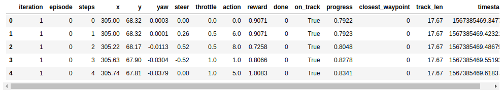
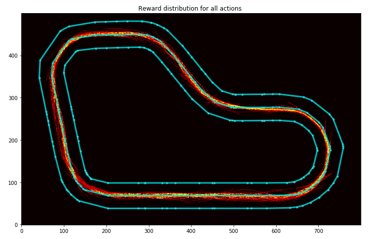
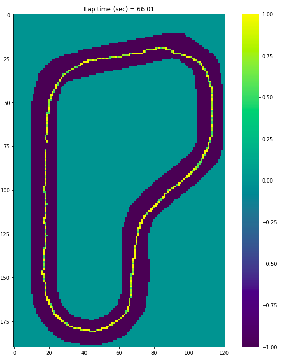
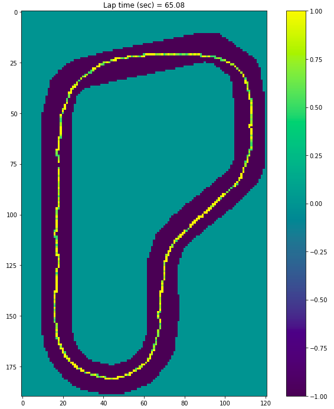
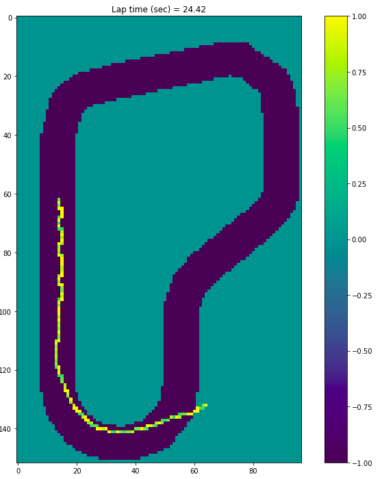
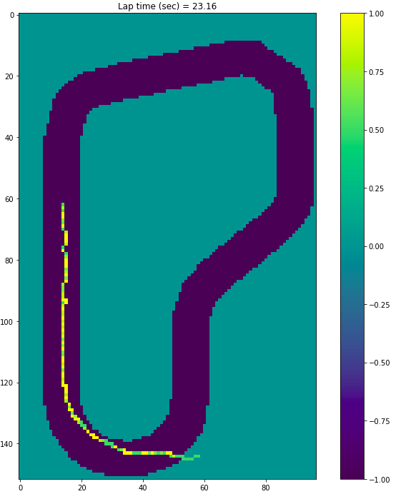
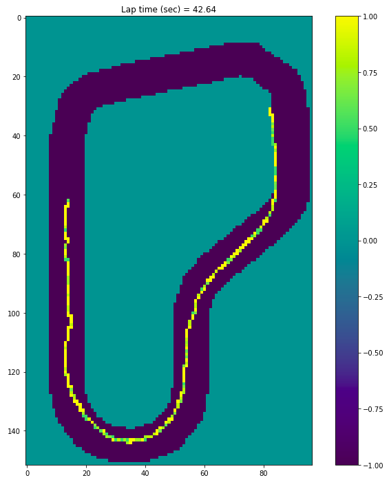
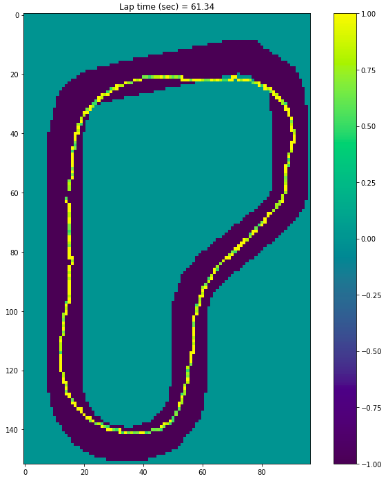
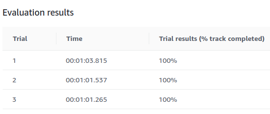

# Nanodegree Engenheiro de Machine Learning
## Capstone Project
Cristian Carlos dos Santos 
22 de setembro de 2019

## I. Definition

### Project Overview

#### Summary

The project is themed on AWS Deep Racer from Amazon. As Amazon itself describes:

“AWS DeepRacer is a reinforcement learning (RL) -enabled autonomous 1 / 18th-scale vehicle with supporting services in the AWS Machine Learning ecosystem. It offers an interactive learning system for users of all levels to acquire and refine their skill set in machine learning in general and reinforcement learning in particular. You can use the AWS DeepRacer console to train and evaluate deep reinforcement learning models in simulation and then deploy them to an AWS DeepRacer vehicle for autonomous driving. You can also join AWS DeepRacer League to race in the online Virtual Circuit or the in-person Summit Circuit. ” [\[1\]](https://aws.amazon.com/deepracer/?nc1=h_ls)

This model of competition and RL learning makes us learn about the subject which is a fascinating but very complex field of study. Recently Udacity launched the AWS DeepRacer Scholarship Challenge and as I had not selected my proposal for the final work I decided to accept this challenge.

### Problem Statement

The goal of my project is to develop and make the cart reach the end by completing 100% of the track. However, as the cost with AWS DeepRacer can quickly become high, I will look for the best solution with few features. My personal goal is $ 50.

#### Datasets and Entries

AWS DeepRacer trains models using the Proximal Policy Optimization (PPO) algorithm. According to AWS DeepRacer course “Value Functions” (L4: Reinforcement Learning) video [\[2\]](https://www.udacity.com/aws-deepracer-scholarship), this algorithm is used because it is efficient, stable and easy to use compared to other algorithms. The Algorithm uses two neural networks during training: Policy Network (Actor-Network) and Value Network (Critic Network).
- Policy Network: Decides what action to take according to the image received in the input.
- Value Network: Estimates the cumulative result we are likely to get, considering the image as an input.

##### Reward

The reward function will be the guide of the algorithm. It will reward positive actions, ie what I would like the cart to accomplish. Besides, it will also penalize unwanted actions such as getting off track during the race. For the construction of the reward function, we have an input of a variable called `params`. This variable is a library in the following format:

```
{
    "all_wheels_on_track": Boolean,    # flag to indicate if the vehicle is on the track
    "x": float,                        # vehicle's x-coordinate in meters
    "y": float,                        # vehicle's y-coordinate in meters
    "distance_from_center": float,     # distance in meters from the track center 
    "is_left_of_center": Boolean,      # Flag to indicate if the vehicle is on the left side to the track center or not. 
    "heading": float,                  # vehicle's yaw in degrees
    "progress": float,                 # percentage of track completed
    "steps": int,                      # number steps completed
    "speed": float,                    # vehicle's speed in meters per second (m/s)
    "steering_angle": float,          # vehicle's steering angle in degrees
    "track_width": float,              # width of the track
    "waypoints": [[float, float], … ], # list of [x,y] as milestones along the track center
    "closest_waypoints": [int, int]    # indices of the two nearest waypoints.
}

```

More information on the reward function is available in the Amazon Deep Racer developer documentation. [\[3\]](https://docs.aws.amazon.com/pt_br/deepracer/latest/developerguide/deepracer-reward-function-input.html).

##### Hyperparameters


Algorithmic hyperparameters are options available in the above mentioned neural networks. With them, we can accelerate role adjustments and define key points in the Reinforcement Learning process, such as having our algorithm prioritize highest reward actions ever discovered or explore more actions to find a better action in a given state. In the AWS Deep Racer console we have the following parameters:
- Gradient descent batch size
- Number of epochs
- Learning rate
- Entropy
- Discount factor
- Loss type
- Number of experience episodes between each policy-updating iteration - (Number of experience episodes between each policy update iteration)

More detailed information about each can be found in the AWS Deep Racer Developer's Guide in the Parameter Settings section. [\[4\]](https://docs.aws.amazon.com/pt_br/deepracer/latest/developerguide/deepracer-console-train-evaluate-models.html#deepracer-iteratively-adjust-hyperparameters).

#### Solution
To solve the proposed problem I will use as a starting point the examples of reward function and hyperparameters available in the AWS Deep Racer documentation examples.
##### Reward
For the reward function, I will use ways to maximize expected actions such as staying on track, gaining speed and completing laps. For this, the idea is to use as the basis of the reward function the parameters `distance_from_center` and` all_wheels_on_track`. Also, I will use the progress multiplier as the reward multiplier so that the reward will be higher as the track progresses.
##### Hyperparameters
Para os hiperparâmetros, conforme vídeo “Intro to Tuning Hyperparameters” (L5: Tuning your model - AWS DeepRacer Course): “Figuring out what works best for your model is usually done through trial and error.”


#### Metrics

As an evaluation metric, the idea is to use **track completion percentage**, **lap completion time**, and visualization of rewards by iteration. To facilitate this analysis I will use the Jupyter notebook available in the article “Using Jupyter Notebook for analysing DeepRacer’s logs” [\[5\]](https://codelikeamother.uk/using-jupyter-notebook-for-analysing-deepracer-s-logs).


## II. ## Analysis

### ### Data Exploration - Training

From the training and assessment performed on the AWS Deep Racer console, training and assessment log files are generated. Using the analysis model available in the AWS Deepracer Workshop Lab Github [\[6\]](https://github.com/aws-samples/aws-deepracer-workshops)  you can download these logs and start the evaluation through the `log-analysis / DeepRacer Log Analysis.ipynb` file. In addition to the training/evaluation logs, a model is generated for the neural networks that are part of the algorithm already explained above. You can download this model from the AWS console so that it can also be evaluated on the Jupyter Notebook already mentioned above.

My initial goal was to find, with the reward function based on the basic standards of the documentation examples and standard hyperparameters, the shortest training time required for the cart to complete one lap. The minimum time I found on the track **re: Invent 2018** was 1H. Following is the reward function used and the hyperparameters:

**Reward Function:**

    def reward_function(params):
	    # Read input parameters
	    track_width = params['track_width']
	    distance_from_center = params['distance_from_center']
	    all_wheels_on_track = params['all_wheels_on_track']
	    steering = abs(params['steering_angle']) # Only need the absolute steering angle
	    progress = params['progress']
	    speed = params['speed']
	    SPEED_THRESHOLD = 1.0
	    SPEED_THRESHOLD_3 = 3.0
	    # Steering penality threshold, change the number based on your action space setting
	    ABS_STEERING_THRESHOLD = 20

	    # Calculate 3 markers that are at varying distances away from the center line
	    marker_1 = 0.1 * track_width
	    marker_2 = 0.25 * track_width
	    marker_3 = 0.5 * track_width

	    # Give higher reward if the car is closer to center line and vice versa
	    if distance_from_center <= marker_1:
	        reward = 1.0
	    elif distance_from_center <= marker_2:
	        reward = 0.5
	    elif distance_from_center <= marker_3:
	        reward = 0.1
	    else:
	        reward = 1e-3  # likely crashed/ close to off track

	    if not all_wheels_on_track:
	        # Penalize if the car goes off track
	        reward = 1e-3
	    elif speed < SPEED_THRESHOLD:
	        # Penalize if the car goes too slow
	        reward = reward - 0.1
	    else:
	        # High reward if the car stays on track and goes fast
	        reward = reward * speed

	    if steering > ABS_STEERING_THRESHOLD:
	        # Penalize reward if the agent is steering too much
	        reward *= 0.8

	    reward = reward + (reward * (progress / 100))

	    return float(reward)

This reward function is to keep the cart on track without major zigzag and adding a multiplier for speed.

**Hyperparameters:**

| Hyperparameters             |      Value    |
|-----------------------------|:-------------:|
| Gradient descent batch size | 64            |
|Entropy|0.01|
|Discount factor | 0.999 |
|Loss type|Huber|
|Learning rate|0.0003|
|N. of experience episodes between each policy-updating iteration|20|
|Number of epochs|10|

Hyperparameters will be kept initially.

##### Log Structure
By using the `DeepRacer Log Analysis.ipynb` notebook we can download the logs straight from AWS as long as the AWS Client is configured. The files needed to run the notebooks evaluated in this report will all be available in the **log-analysis /** (logs) and **log-analysis / intermediate_checkpoint** (templates) folder.

##### Analysis Notebook
Initially, we will evaluate the resulting 1-hour training notebook with the functions defined above. It is located in the `log-analysis /` folder named `06 - DeepRacer Log Analysis - MyTrain 60 min speed.ipynb`.

Training logs after being uploaded to a DataFrame are displayed as shown below:


Para avaliar as estatísticas selecionei as colunas que achei mais importantes para a avaliação:


In the image it is possible to evaluate the following points:

- **Iteration (2) and episode (39)**: We have a low number of iterations and episodes due to the short training time.
- **Throttle:** With an average of 0.7765 it is possible to estimate that the trolley has been accelerating much of the training time.
- **Reward:** We have a reward average of 1.05. If we are to evaluate the current reward function, we can see that this reward is awarded when the cart is too close to the center of the track. Since the focus of the race is lap time, possibly the basis of the reward cannot be the distance from the center of the track.
- **Progress:** Well, we reached 100%.

### ### Exploratory Visualization - Training

#### Action reward assessment


For evaluation of the following graphs, it is necessary to take as the base that the X-axis and Y-axis are, respectively, columns X and Y of the Dataframe evaluated in the section "analysis notebooks".

##### General evaluation

In the image below you can see the rewards returned in the training process.




##### Evaluation Iteration 2

In the image below you can see the rewards of a specific training iteration.


##### Path taken for top reward iterations


In the images above it is possible to confirm what was raised in the "Analysis Notebook" section regarding the issue of the reward having an average close to 1 because the basis of the reward composition is the distance from the center of the track. Both in the overall evaluation image and the evaluation image of a specific iteration, in this case, iteration 2, it is seen that the reward distribution is very close to the center of the track.  
  
Besides, the path taken for the most rewarding iterations is extremely aligned with the center of the track.  
  
### Exploratory Visualization - Training v1  
  
**AWS assessment result:**


In the evaluation stage we have to understand how the cart behaved on the track during the three attempts to complete the race.

** Attempt 1: **




**Attempt 2:**


**Attempt 3:**




You can see that the same training pattern is repeated during the evaluation phase. The Cart tried to stay in the center of the track, sometimes sacrificing speed to make it happen.

### Algorithms and Techniques

As described in step **I.Definition** AWS DeepRacer trains models using the Proximal Policy Optimization (PPO) algorithm. This project is an algorithm optimization project already defined and used by AWS Deep Racer. In the **Data Sets and Inputs** and **Data Exploration** steps the initial default reward function and the hyperparameters used as the starting point for analysis have already been described.

### Benchmark

As a reference, I am based on the “re: Invent 2018” winner who completed the lap in 12.68 secs [\[7\]](https://medium.com/vaibhav-malpanis-blog/how-to-win-at-deepracer-league-code-and-model-included-27742b868794). For this model the following reward function was used:

```
def reward_function(params):
    track_width = params['track_width']
    distance_from_center = params['distance_from_center']
    all_wheels_on_track = params['all_wheels_on_track']
    speed = params['speed']
    SPEED_THRESHOLD = 1.0 

    
    # Calculate 3 markers that are at varying distances away from the center line
    marker_1 = 0.1 * track_width
    marker_2 = 0.25 * track_width
    marker_3 = 0.5 * track_width
    
    # Give higher reward if the car is closer to center line and vice versa
    if distance_from_center <= marker_1:
        reward = 1.0
    elif distance_from_center <= marker_2:
        reward = 0.5
    elif distance_from_center <= marker_3:
        reward = 0.1
    else:
        reward = 1e-3  # likely crashed/ close to off track

    if not all_wheels_on_track:
		# Penalize if the car goes off track
        reward = 1e-3
    elif speed < SPEED_THRESHOLD:
		# Penalize if the car goes too slow
        reward = reward + 0.5
    else:
		# High reward if the car stays on track and goes fast
        reward = reward + 1.0

    return float(reward)

```

In hyperparameters, the following were used:

| Hyperparameter              |      Value    |
|-----------------------------|:-------------:|
| Gradient descent batch size | 64            |
|Entropy|0.01|
|Discount factor | 0.666 |
|Loss type|Huber|
|Learning rate|0.0003|
|N. of experience episodes between each policy-updating iteration|20|
|Number of epochs|10|


From these benchmarks, I want to walk the path between this great benchmark and the default parameters. If possible, further refine the model and test the results. **However, it is important to note that the training time used by the competitor was not reported**.


## III. Methodology

### Data Preprocessing

As assessed in the **Data Exploration - Training** section the standard reward function used showed a strong tendency to keep the cart in the center of the track. This is not all bad, but when it comes to a race, the idea is that the lap time will be better.

Because of this, I changed the reward function based on the speed of the cart. Another big change is that the distance from the center of the track will have greater flexibility, with discounts, even if few, at the ends of the track. I kept the reward bonus as the track progressed and the penalty to avoid zigzagging.

Thus, the current reward function was as follows:

    def reward_function(params):
	    # Read input parameters
	    track_width = params['track_width']
	    distance_from_center = params['distance_from_center']
	    all_wheels_on_track = params['all_wheels_on_track']
	    steering = abs(params['steering_angle'])  # Only need the absolute steering angle
	    progress = params['progress']
	    speed = params['speed']
	    # Steering penality threshold, change the number based on your action space setting
	    ABS_STEERING_THRESHOLD = 20

	    if not all_wheels_on_track:
	        # Penalize if the car goes off track
	        reward = 1e-3
	    else:
	        reward = speed

	    # Calculate 3 markers that are at varying distances away from the center line
	    marker_1 = 0.4 * track_width
	    marker_2 = 0.45 * track_width
	    marker_3 = 0.5 * track_width

	    # Give higher reward if the car is closer to center line and vice versa
	    if distance_from_center <= marker_1:
	        reward *= 1
	    elif distance_from_center <= marker_2:
	        reward *= 0.9
	    elif distance_from_center <= marker_3:
	        reward *= 0.85
	    else:
	        reward = 1e-3  # likely crashed/ close to off track

	    if steering > ABS_STEERING_THRESHOLD:
	        # Penalize reward if the agent is steering too much
	        reward *= 0.8

	    reward = reward + (reward * (progress / 100))


	    return float(reward)


### Implementation

After adjusting the reward function as specified in the **Data Preprocessing** section, 1-hour training was conducted to evaluate the effectiveness of this reward function during the same training time. An important note is that no changes were made to the hyperparameters initially. The analysis notebook is in the `log-analysis /` folder named `09 - DeepRacer Log Analysis - Final 60 min.ipynb`.

#### Exploratory Visualization - Training v2

With this training the following results were obtained:

##### Overall Share Reward Rating

In the image below you can see the rewards returned in the training process.


Unlike the first reward function, you can see that the cart is exploring the track more. This allows you to check for more "travel errors" than in the first version.

##### Path taken for top reward iterations

In this first image, you can see that the car maintained a certain proximity to the center of the track, but was not as rigorous as the first model.


I would like to demonstrate that the second highest score iteration was less rigorous than the first in keeping the cart in the center of the track.


**AWS assessment result:**

In assessing the speed-based model, 1 hour of training is not enough to complete 100% of the track.


It is possible to see in the attempts the constant use of the acceleration, causing the exit of the track.

**Attempt 1:**


**Attempt 2:**




**Attempt 3:**




### Refinement

Since in the first model (standard v1) I already reached the goal of completing 100% of the track, I will try to optimize the completion time back. For this I will make some hyperparameter adjustments to speed up the training, remembering that the personal goal is not to exceed the cost of $ 50.00.

To do this, I will clone version 1 of the training model (which is evaluated on the `09 - DeepRacer Log Analysis - Final 60 min.ipynb` notebook), which would be the speed-focused reward function model. in the first hour of training and I will add another 30 minutes of training with the following adjustments:

- **Learning rate:** 0.0009
- **Gradient descent batch size:** 32

The idea is that with more frequent update streams and larger jumps, algorithm adjustments will be accelerated.

With these adjustments I achieved the following AWS evaluation results:


We have a breakthrough in terms of track progress percentage, but not lap time. It's worth noting that 30 minutes is a low time for a more concrete assessment, but I want to highlight the following cart iteration:


You can see that in the signaled curve it did not prioritize the center of the track but the speed. You can also see below that the same, during the evaluation left the track exactly at this point:




As for the iteration reward charts, no major changes were observed due to the reward function remaining the same.

To recap, we have so far a model with a speed-based reward function that **has been trained for 1.5 hours**. With that, I will add **another 60-minute training**, but adjusting some reward parameters.

- **Learning rate:** 0.0003
- **Discount factor:** 0.888
- **Gradient descent batch size:** 64

The idea is to move back to more conservative parameters, but with a slight adjustment in the discount factor, as I believe that decreasing the number of future steps to be considered for reward prioritizes momentary actions.

Also, by slightly assessing the reward function, the progress variable may have offset the speed-based reward.

This may have been due to the following code snippet:

`reward = reward + (reward * (progress / 100))`

As the reward is based on speed / progress the following cases may occur:

With speed = 1 and progress = 25%, the reward would be:
**1.25** = 1 + (1 * (25/100))

With speed = 0.8 and progress = 75%, the reward would be:
**1.4** = 0.8 + (0.8 * (75/100))

With this, it is possible that as the progress increases, the model prefers to slow down to ensure a greater reward.

To resolve this situation, I decided to remove this progress-related factor. Another change was the removal of the penalty based on the `steering_angle` variable for two reasons:

- At times the trolley would slow down in straight stretches of track just so that it could align with the set angle (image below).
- Since initial model training was initially performed with this parameter, the initial zigzag problems were decreased.


Por fim, ficam com a seguinte função de recompensa:

	def reward_function(params):
	    # Read input parameters
	    track_width = params['track_width']
	    distance_from_center = params['distance_from_center']
	    all_wheels_on_track = params['all_wheels_on_track']
	    steering = abs(params['steering_angle'])  # Only need the absolute steering angle
	    progress = params['progress']
	    speed = params['speed']
	    # Steering penality threshold, change the number based on your action space setting
	    ABS_STEERING_THRESHOLD = 20

	    if not all_wheels_on_track:
	        # Penalize if the car goes off track
	        reward = 1e-3
	    else:
	        reward = speed

	    # Calculate 3 markers that are at varying distances away from the center line
	    marker_1 = 0.4 * track_width
	    marker_2 = 0.45 * track_width
	    marker_3 = 0.5 * track_width

	    # Give higher reward if the car is closer to center line and vice versa
	    if distance_from_center <= marker_1:
	        reward *= 1
	    elif distance_from_center <= marker_2:
	        reward *= 0.9
	    elif distance_from_center <= marker_3:
	        reward *= 0.85
	    else:
	        reward = 1e-3  # likely crashed/ close to off track


	    return float(reward)

Além disso, o notebook desta análise encontra-se na pasta log-analysis/ com nome 13 - DeepRacer Log Analysis - Final 60 min - v2-v6.ipynb` .

## IV. Resultados

### Modelo de avaliação e validação

**Resultado da avaliação pela AWS:**

Antes de avaliarmos o resultado do progresso x tempo de volta, vamos somente visualizar como o treinamento distribuiu as recompensas por iterações.


Agora vamos verificar como o modelo performou nas 3 tentativas de avaliação da AWS:

**Tentativa 1:**


**Tentativa 2:**




**Tentativa 3:**


Agora vamos comprar este modelo com o modelo inicial focado na permanência no centro da pista:

**Modelo padrão (Focado na centralidade da pista):**


**Modelo atual (Focado na velocidade):**



Do modelo padrão para o modelo desenvolvido encontramos 7,071 segundos de diferença, com o total de 2,5 H de treinamento. 


### Justificativa

De certa forma os modelos desenvolvidos (Foco Centro da pista e Foco em Velocidade) apresentaram resultados melhores que o modelo de benchmark em até 3 H de treinamento.

**Modelo benchmark:**

É possível verificar na imagem abaixo que a função de recompensa e os hyperparâmetros do modelo benchmark não completaram a volta durante as três tentativas de avaliação do modelo treinado durante 3H.


Como o modelo de benchmark não deixa claro o tempo no qual foi treinado, não é possível avaliarmos o resultado de forma mais precisa.

**Modelo padrão (Focado na centralidade da pista):**


**Modelo atual (Focado na velocidade):**


Quanto a questão "*A solução final é significativa o suficiente para ter resolvido o problema?*":
Avaliando o desafio proposto, completar 100% da pista gastando menos de U$ 50,00 entendo que sim, ela é significativa o suficiente para completar o desafio dando subsídios para uma continuídade do trabalho, inclusive. 

## V. Conclusão

### Foma livre de visualização

A principal qualidade que poderia elencar no meu projeto é o conhecimento contruído sobre o funcionamento das funções de recompensas definidas e hyperparâmetros utilizados. 

As visualizações que demonstram de forma mais representativa as diferenças entre a função de recompensa inicial, focada na distância do centro da pista, e a final, focada em velocidade, são as seguintes:

**Modelo Padrão Inicial**


**Modelo Final**


É visível a forma como o modelo padrão inicial não explorava toda extensão da pista, por vezes reduzindo a velocidade do carrinho para isso. Já na segunda imagem é possível verificar como o carrinho por vezes "espalha a curva" para compensar a velocidade. E isso tudo devido a definição base da função recompensa.

As função de recompensas utilizam um número limitado de parâmetros. Isso faz com que a possibilidade de parametrizações também sejam limitadas, porém deixa para o algoritmo de RL a maior parte do aprendizado.

O desenvolvedor da função de recompensa sempre terá que ter um equilibro entre definir uma função de recompensa extremamente complexa e uma abrangente, para que o algoritmo de RL tenha a flexibilidade de encontrar outras formas de "resolver o seu problema".


### Reflexão

Basicamente as tarefas de RL são muito exploratórios e abrangentes. Para resolver esse problema escolhido, segmentei da seguinte forma meu trabalho:
- Experimentação acerca do funcionamento da plataforma AWS Deep Racer.
- Definição dos marcos de início, como função padrão de recompensa e modelo de benchmark.
- Avaliação dos dados gerados a partir da primeira rodada de treinamento/avaliação.
- Estudo sobre impactos dos parâmetros da função de recompensa.
- Implementação da nova função de recompensa e ajuste de hyperparâmetros.
- Avaliação dos dados gerados a partir da nova rodada de treinamento/avaliação.
- Estudo sobre possiveis melhorias e pontos de impactos negativos na performance do modelo e função de recompensa.
- Nova rodada de treinamento/avaliação.
- Composição e avaliação dos resultados obtidos.

Como Reinforcement Learning é uma área nova para mim, a complexidade de cenários (ações, estados, recompensas, etc) e o risco de alto custo na plataforma AWS são os maiores desafios do meu projeto.

Quanto a solução final, ela ficou abaixo do resultado inicial que eu esperava (os 11 segundos do modelo de benchmark). Porém, o processo de avaliação foi tão produtivo e mostrou-se muito explicativo que compensou e muito essa diferença entre o tempo de volta que eu esperava. Sem falar que mesmo o modelo de benchmark, com treinamento inferior a 3 H não performou tão bem, por vezes não completando a pista nas avaliações.

### Melhorias

Quanto a melhorias são muitas possibilidades. As principais que eu elencaria seriam as seguintes:

- Estudo do parâmetro `heading` para uso na função de recompensa como um auxiliar na centralização mais suave do carrinho na pista.
- Maior tempo de treinamento (horas) do modelo final gerado para avaliar esse processo com mais iterações, para que seja verificado se o modelo ficaria super ajustado.
- Treinamento do modelo em outras pistas, para que o mesmo se adapte as mais variadas possibilidades de pistas.

-----------


### Referências:
[\[1\]](https://aws.amazon.com/deepracer/?nc1=h_ls) AWS DeepRacer - the fastest way to get rolling with machine learning. Retrieved from https://aws.amazon.com/deepracer/?nc1=h_ls

[\[2\]](https://www.udacity.com/aws-deepracer-scholarship) AWS DeepRacer Scholarship with Udacity. Retrieved from https://www.udacity.com/aws-deepracer-scholarship

[\[3 \]](https://docs.aws.amazon.com/pt_br/deepracer/latest/developerguide/deepracer-reward-function-input.html)
Parâmetros de entrada da função de recompensa do AWS DeepRacer - AWS DeepRacer. Retrieved from https://docs.aws.amazon.com/pt_br/deepracer/latest/developerguide/deepracer-reward-function-input.html

[\[4\]](https://docs.aws.amazon.com/pt_br/deepracer/latest/developerguide/deepracer-console-train-evaluate-models.html#deepracer-iteratively-adjust-hyperparameters) Treinar e avaliar modelos do AWS DeepRacer usando o console do AWS DeepRacer - AWS DeepRacer. Retrieved from https://docs.aws.amazon.com/pt_br/deepracer/latest/developerguide/deepracer-console-train-evaluate-models.html#deepracer-iteratively-adjust-hyperparameters

[\[5\]](https://codelikeamother.uk/using-jupyter-notebook-for-analysing-deepracer-s-logs)
Using Jupyter Notebook for analysing DeepRacer's logs - Code Like A Mother. Retrieved from https://codelikeamother.uk/using-jupyter-notebook-for-analysing-deepracer-s-logs

[\[6\]](https://github.com/aws-samples/aws-deepracer-workshops)
aws-samples/aws-deepracer-workshops. Retrieved from https://github.com/aws-samples/aws-deepracer-workshops

[\[7\]](https://medium.com/vaibhav-malpanis-blog/how-to-win-at-deepracer-league-code-and-model-included-27742b868794) How to win at DeepRacer League? (code and model included) | AWS DeepRacer Championship Cup | re:Invent 2019. Retrieved from  https://medium.com/vaibhav-malpanis-blog/how-to-win-at-deepracer-league-code-and-model-included-27742b868794
<!--stackedit_data:
eyJoaXN0b3J5IjpbNjA4MzAxMzYxLDE1OTY0MzA0NTYsLTE0MD
QxNTg3NTZdfQ==
-->